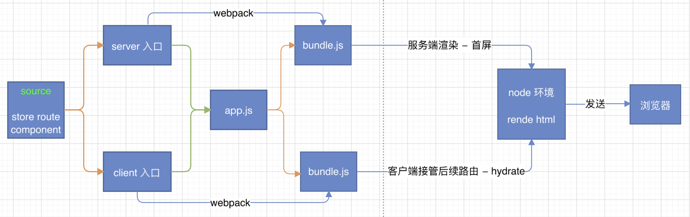
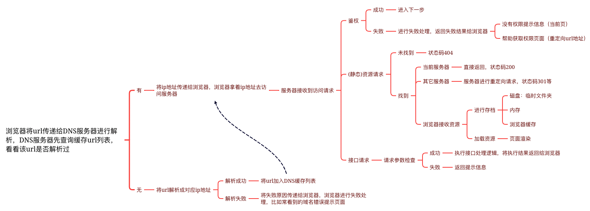

# react 同构



## 从浏览器中输入一个 url 到显示页面，这个过程发生了哪些事情？



```
  浏览器输入url -> DNS缓存(是否访问过该url) -> 服务器返回html

  ssr Server-Side Rendering 提前加载好资源，将完整的html结构返回
  csr Client-Side Rendering 接收服务器返回html页面，自行加载资源
  spa Single Page Application 接收服务器返回html基本结构，通过 js 加载 页面内容

  SEO      ssr 已有 html 完整结构，spa 只有 html 基本结构，没有内容
  首屏加载   ssr 已提前加载完页面内容，spa 需要自行加载内容
```

## ssr 结构

server 端 使用 node（express）
client 端 使用 react
public 静态资源及 client 端 打包源码
build server 端打包源码

## 安装依赖

npm i

## 启动项目

npm run start

# ssr 自行搭建步骤

  ## 步骤 1：环境准备

  ### 创建目录，初始化 package.json
  - mkdir react-isomorphic-example
  - cd react-isomorphic-example
  - npm init --yes

  ### 根目录分别创建 server 端 和 client 端 入口文件
  mkdir server && touch server/index.js
  mkdir client && touch client/index.js

  ### 分别创建 server 端 和 client 端 webpack 配置文件
  touch server/webpack.config.js client/webpack.config.js

  ### 安装依赖包
  npm i webpack webpack-cli webpack-node-externals babel-loader @babel/core @babel/preset-react @babel/preset-env -D

  ```
  webpack 打包工具
  webpack-cli                       webpack脚手架，用于实时编译和打包源码
  webpack-node-externals            不打包 node 环境的 node_modules
  babel-loader                      在webpack中，使用 loader 解析 js 文件
  @babel/core                       babel 核心源码
  @babel/preset-react               支持 react 及 jsx
  @babel/preset-env                 支持 es 最新语法
  ```

  ### 搭建 webpack 基本配置
  ```js
  // server/webpack.config.js
  const path = require('path');
  const nodeExternals = require('webpack-node-externals');
  const resolve = (dir) => path.resolve(__dirname, dir);

  module.exports = {
    target: 'node',
    mode: 'development',
    entry: './server/index.js',
    output: {
      path: resolve('../build'),
      filename: 'bundle.js',
    },
    externals: [nodeExternals()],
    module: {
      rules: [
        {
          test: /.js$/,
          loader: 'babel-loader',
          exclude: /node_modules/,
          options: {
            presets: ['@babel/preset-react', ['@babel/preset-env']],
          },
        },
      ],
    },
  };
  ```

  ```js
  // client/webpack.config.js
  const path = require('path');
  const resolve = (dir) => path.resolve(__dirname, dir);

  module.exports = {
    mode: 'development',
    entry: './client/index.js',
    output: {
      path: resolve('../public'),
      filename: 'bundle.js',
    },
    module: {
      rules: [
        {
          test: /.js$/,
          loader: 'babel-loader',
          exclude: /node_modules/,
          options: {
            presets: ['@babel/preset-react', ['@babel/preset-env']],
          },
        },
      ],
    },
  };
  ```

  ### package.json 添加编译命令
  - 新增 server 端 和 client 端 编译命令
  - 新增 启动命令，使用 nodemon 监听 server 端 编译目录 并执行 入口 js
  - 使用 concurrently 执行多命令，避免开启多个终端执行编译命令，安装命令 npm i concurrently -D
  - 注意：nodemon 一般为全局包，安装命令 npm i nodemon -g

  ```json
  "scripts": {
    "start": "concurrently \"npm run dev:client\" \"npm run dev:server\" \"npm run dev:start\"",
    "dev:client": "webpack --config client/webpack.config.js --watch",
    "dev:server": "webpack --config server/webpack.config.js --watch",
    "dev:start": "nodemon --watch build --exec node \"./build/bundle.js\""
  }
  ```

  ### 搭建 server 端 基础环境

  - 使用 express，安装依赖 npm i express -S

    ```js
    // server/index.js
    import express from 'express';

    const app = express();

    app.get('*', (req, res) => {
      res.send('Welcome to react isomorphic');
    });

    app.listen(9099, () => console.log('server listen'));
    ```

  - 测试服务器环境是否搭建成功 http://localhost:9099

  ### 搭建 client 端 基础环境

  - 接入 react，安装依赖 npm i react react-dom -S
  - client 目录下创建 src 目录，src 目录下 创建 App.js
    mkdir client/src && touch client/src/App.js

    ```js
    // App.js
    import React, { useState } from 'react';

    function App(props) {
      const [count, setCount] = useState(0);

      return (
        <div>
          <h3>App</h3>
          <p>count is : {count}</p>
          <button onClick={() => setCount(count + 1)}>increment</button>
        </div>
      );
    }

    export default App;
    ```

    ### server 端 接入 App.js
    ```js
    // server/index.js
    import express from 'express';
    import React from 'react';
    import { renderToString } from 'react-dom/server';
    import App from '../client/src/App';

    const app = express();
    // 设置静态资源目录，要不然无法访问客户端 js
    app.use(express.static('public'));

    app.get('*', (req, res) => {
      const content = renderToString(<App />);
      const htmlTmp = `
        <!DOCTYPE html>
        <html>
          <head>
            <meta charset="utf-8" />
            <title>react ssr</title>
          </head>
          <body>
            <div id="root">${content}</div>
            <!--加载客户端-->
            <script src="/bundle.js"></script>
          </body>
        </html>
      `;
      res.send(htmlTmp);
    });

    app.listen(9099, () => console.log('server listen'));
    ```
    ### client 端 接入 App.js
      ```js
      // client/index.js
      import React from 'react';
      import { hydrateRoot } from 'react-dom/client';
      import App from './src/App';

      const root = document.getElementById('root');
      // server端已渲染dom，client端只需要注入接管后续操作
      hydrateRoot(root, <App />);
      ```
